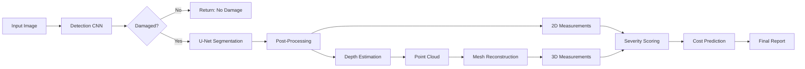

# U-DRS: Universal Image-to-3D Damage Reconstruction System

[](https://www.python.org/)
[](https://pytorch.org/)
[](LICENSE)

**U-DRS** is a production-grade, end-to-end system that transforms 1-2 images of damaged objects into comprehensive 3D damage reports with precise measurements, severity scoring, and cost predictions.


---

## 🚀 Features

### Core Capabilities
- ✅ **Damage Detection**: CNN-based binary classification (ResNet18)
- ✅ **Precision Segmentation**: U-Net for pixel-perfect damage masks
- ✅ **Depth Estimation**: MiDaS/DPT integration for monocular depth
- ✅ **3D Reconstruction**: Point cloud → Poisson mesh pipeline
- ✅ **Comprehensive Measurements**:
  - 2D: Area, perimeter, crack length/width, shape descriptors
  - 3D: Depth, volume, surface deformation
- ✅ **ML Predictions**:
  - Severity scoring (0-100 scale)
  - Cost estimation with confidence intervals
  - Urgency classification & timeline recommendations
- ✅ **REST API**: FastAPI server with complete endpoints
- ✅ **CLI Interface**: Single-command processing
- ✅ **Synthetic Data Generator**: Create training datasets

### Damage Types Supported
- 🔸 Cracks (concrete, asphalt, walls)
- 🔸 Dents & Impact Damage (vehicles, metal surfaces)
- 🔸 Corrosion & Rust
- 🔸 Potholes
- 🔸 Surface Deformation
- 🔸 General structural damage

---

## 📋 Table of Contents

- [Installation](#installation)
- [Quick Start](#quick-start)
- [Usage](#usage)
  - [CLI Usage](#cli-usage)
  - [Python API](#python-api)
  - [REST API](#rest-api)
- [Project Structure](#project-structure)
- [Architecture](#architecture)
- [Datasets](#datasets)
- [Training](#training)
- [Evaluation](#evaluation)
- [Deployment](#deployment)
- [API Documentation](#api-documentation)
- [Examples](#examples)
- [Contributing](#contributing)
- [Citation](#citation)

---

## ⚙️ Installation

### Prerequisites
- Python 3.8+
- CUDA 11.7+ (optional, for GPU acceleration)
- 8GB RAM minimum (16GB recommended)
- 4GB VRAM for GPU mode

### Step 1: Clone Repository
```bash
git clone https://github.com/yourusername/U-DRS.git
cd U-DRS
```

### Step 2: Create Virtual Environment
```bash
python -m venv venv
source venv/bin/activate  # On Windows: venv\Scripts\activate
```

### Step 3: Install Dependencies
```bash
pip install -r requirements.txt
```

### Step 4: Download Pretrained Models (Optional)
```bash
# Models will auto-download on first use
# Or manually download:
python scripts/download_models.py
```

---

## 🏃 Quick Start

### Single Image Analysis
```bash
python run_inference.py --input samples/crack.jpg
```

### With Calibration
```bash
python run_inference.py \
  --input samples/dent.jpg \
  --pixel-mm-ratio 0.5 \
  --depth-scale 2.0
```

### Start API Server
```bash
uvicorn api.main:app --reload --port 8000
```

Then visit `http://localhost:8000/docs` for interactive API documentation.

---

## 📖 Usage

### CLI Usage

#### Basic Analysis
```bash
python run_inference.py --input path/to/image.jpg
```

#### Advanced Options
```bash
python run_inference.py \
  --input damage.jpg \
  --output results/analysis_001 \
  --pixel-mm-ratio 0.8 \
  --depth-scale 1.5 \
  --no-3d \
  --device cuda \
  --verbose
```

**Arguments:**
- `--input, -i`: Input image path (required)
- `--output, -o`: Output directory (default: auto-generated)
- `--pixel-mm-ratio`: Calibration for 2D measurements (default: 1.0)
- `--depth-scale`: Calibration for depth (default: 1.0)
- `--no-3d`: Skip 3D reconstruction (faster)
- `--device`: cpu or cuda (default: auto-detect)
- `--verbose, -v`: Enable detailed logging

### Python API

```python
from pipeline.inference import create_pipeline

# Create pipeline
pipeline = create_pipeline(
    device="cuda",
    pixel_to_mm_ratio=0.5,
    depth_scale=2.0
)

# Process image
results = pipeline.process(
    image_path="samples/crack.jpg",
    save_outputs=True,
    generate_3d=True
)

# Access results
print(f"Severity: {results['severity']['class']}")
print(f"Score: {results['severity']['score']}")
print(f"Area: {results['measurements']['summary']['damage_area_mm2']} mm²")
print(f"Cost: ${results['cost_urgency']['cost_prediction']['estimated_cost_usd']}")
```

### REST API

#### Upload and Analyze
```bash
curl -X POST "http://localhost:8000/api/analyze" \
  -F "file=@crack.jpg" \
  -F "pixel_to_mm_ratio=0.5" \
  -F "generate_3d=true"
```

#### Retrieve Results
```bash
curl "http://localhost:8000/api/result/{analysis_id}"
```

#### Download 3D Model
```bash
curl "http://localhost:8000/api/download/{analysis_id}/mesh" -o mesh.ply
```

See [API Documentation](#api-documentation) for complete API reference.

---

## 📁 Project Structure

```
U-DRS/
├── models/                      # Deep learning models
│   ├── detection/               # Damage detection (ResNet18)
│   ├── segmentation/            # U-Net segmentation
│   ├── depth/                   # MiDaS depth estimation
│   └── prediction/              # Severity & cost ML models
├── reconstruction/              # 3D reconstruction pipeline
│   ├── point_cloud.py          # Point cloud generation
│   ├── mesh_builder.py         # Poisson mesh reconstruction
│   └── visualizer.py           # 3D visualization
├── measurements/                # Measurement calculation
│   ├── geometric.py            # 2D measurements
│   ├── volumetric.py           # 3D measurements
│   └── analyzer.py             # Unified interface
├── pipeline/                    # Inference orchestration
│   ├── inference.py            # End-to-end pipeline
│   └── config.py               # Configuration management
├── api/                         # FastAPI REST API
│   ├── main.py                 # API server
│   └── schemas.py              # Request/response models
├── utils/                       # Utilities
│   ├── dataset_generator.py   # Synthetic data generation
│   ├── metrics.py              # Evaluation metrics
│   ├── visualization.py        # Result visualization
│   └── logger.py               # Logging
├── data/                        # Data storage
│   ├── samples/                # Sample images
│   ├── models/                 # Model weights
│   └── outputs/                # Analysis results
├── docs/                        # Documentation
├── tests/                       # Unit & integration tests
├── requirements.txt             # Python dependencies
├── run_inference.py            # CLI entry point
└── README.md                   # This file
```

---

## 🏗️ Architecture

### Pipeline Flow



### Component Details

1. **Detection (ResNet18)**
   - Binary classifier: Damaged vs Intact
   - Transfer learning from ImageNet
   - Grad-CAM visualization support

2. **Segmentation (U-Net)**
   - Encoder-decoder with skip connections
   - Pixel-level damage masks
   - Post-processing with morphological ops

3. **Depth Estimation (MiDaS v3.1)**
   - Monocular depth prediction
   - Relative depth maps
   - Optional metric calibration

4. **3D Reconstruction**
   - Camera calibration
   - Point cloud generation
   - Poisson surface reconstruction

5. **Measurements**
   - **2D**: Area, perimeter, crack length/width, shape analysis
   - **3D**: Depth, volume, surface deformation

6. **ML Predictions**
   - **Severity**: Rule-based + ML hybrid (0-100 score)
   - **Cost**: Regression model with confidence intervals
   - **Urgency**: Classification (Immediate/Urgent/Scheduled/Monitor)

---

## 📊 Datasets

### Real-World Datasets

1. **Crack Detection**
   - [CrackForest](https://github.com/cuilimeng/CrackForest-dataset)
   - [Crack500](https://github.com/fyangneil/pavement-crack-detection)
   - [DeepCrack](https://github.com/yhlleo/DeepCrack)

2. **Corrosion**
   - [Corrosion Condition State Dataset](https://data.mendeley.com/datasets/c3j8fvtdsc/1)

3. **General Damage**
   - [VisA (Visual Anomaly Detection)](https://github.com/amazon-science/spot-diff)

### Synthetic Dataset Generation

```bash
python utils/dataset_generator.py --num-samples 1000 --output data/synthetic
```

This generates realistic synthetic damage images with ground truth masks for:
- Cracks (branching patterns)
- Dents (Gaussian deformations)
- Corrosion (irregular patterns)

---

## 🎓 Training

### Segmentation Model Training

```bash
python models/segmentation/segmentation_train.py \
  --data data/synthetic \
  --epochs 50 \
  --batch-size 16 \
  --lr 0.001
```

### Detection Model Training

```bash
python models/detection/detector_train.py \
  --data data/synthetic \
  --epochs 30 \
  --batch-size 32
```

---

## 📈 Evaluation

### Run Comprehensive Evaluation

```python
from utils.metrics import EvaluationMetrics

# Segmentation metrics
metrics = EvaluationMetrics.evaluate_segmentation(pred_mask, gt_mask)
print(f"Dice: {metrics['dice']:.3f}")
print(f"IoU: {metrics['iou']:.3f}")

# Depth metrics
depth_metrics = EvaluationMetrics.evaluate_depth(pred_depth, gt_depth)
print(f"RMSE: {depth_metrics['rmse']:.3f}")

# 3D reconstruction
recon_metrics = EvaluationMetrics.evaluate_3d_reconstruction(pred_pcd, gt_pcd)
print(f"Chamfer: {recon_metrics['chamfer_distance']:.3f}")
```

---

## 🚀 Deployment

### Docker Deployment

```bash
# Build image
docker build -t udrs:latest .

# Run container
docker run -p 8000:8000 --gpus all udrs:latest
```

### GPU Optimization

```python
# Enable ONNX export (optional)
from pipeline.config import config
config.ENABLE_ONNX = True
```

### Edge Device Deployment

1. Use smaller models: `MiDaS_small` instead of `DPT_Large`
2. Reduce input resolution: `INPUT_SIZE = (320, 240)`
3. Skip 3D reconstruction for real-time processing
4. Consider TensorRT optimization (NVIDIA devices)

---

## 📚 API Documentation

### Endpoints

| Method | Endpoint | Description |
|--------|----------|-------------|
| GET | `/` | Root information |
| GET | `/api/health` | Health check |
| POST | `/api/analyze` | Upload & analyze image |
| GET | `/api/result/{id}` | Get analysis results |
| GET | `/api/download/{id}/{type}` | Download specific file |
| GET | `/api/list` | List all analyses |
| DELETE | `/api/result/{id}` | Delete analysis |

### Interactive Docs
Visit `http://localhost:8000/docs` when server is running.

---

## 💡 Examples

### Example 1: Crack Analysis
```python
pipeline = create_pipeline(pixel_to_mm_ratio=0.8)
results = pipeline.process("samples/crack.jpg")
# → Severity: MODERATE, Length: 250mm, Width: 3.5mm
```

### Example 2: Dent with Depth
```python
pipeline = create_pipeline(depth_scale=1.5)
results = pipeline.process("samples/dent.jpg")
# → Depth: 15mm, Volume: 2500mm³, Cost: $450
```

### Example 3: Batch Processing
```python
from pathlib import Path
pipeline = create_pipeline()

for img_path in Path("samples").glob("*.jpg"):
    results = pipeline.process(img_path)
    print(f"{img_path.name}: {results['severity']['class']}")
```

---

## 🛠️ Performance

### Benchmarks (NVIDIA RTX 3080)
- Detection: ~0.05s
- Segmentation: ~0.08s
- Depth Estimation: ~0.15s
- 3D Reconstruction: ~0.30s
- **Total**: ~0.60s per image

### CPU Mode (Intel i7)
- **Total**: ~5-8s per image

---

## 🤝 Contributing

We welcome contributions! Please see [CONTRIBUTING.md](CONTRIBUTING.md) for guidelines.

---

## 📄 License

This project is licensed under the MIT License - see [LICENSE](LICENSE) file.

---

## 📧 Contact

- **Issues**: [GitHub Issues](https://github.com/yourusername/U-DRS/issues)
- **Email**: your.email@example.com

---

## 🙏 Acknowledgments

- [MiDaS](https://github.com/isl-org/MiDaS) for depth estimation
- [Open3D](http://www.open3d.org/) for 3D processing
- [FastAPI](https://fastapi.tiangolo.com/) for web framework

---

## 📖 Citation

If you use U-DRS in your research, please cite:

```bibtex
@software{udrs2024,
  title={U-DRS: Universal Image-to-3D Damage Reconstruction System},
  author={Your Name},
  year={2024},
  url={https://github.com/yourusername/U-DRS}
}
```

---

**Made with ❤️ for damage assessment and structural health monitoring**
