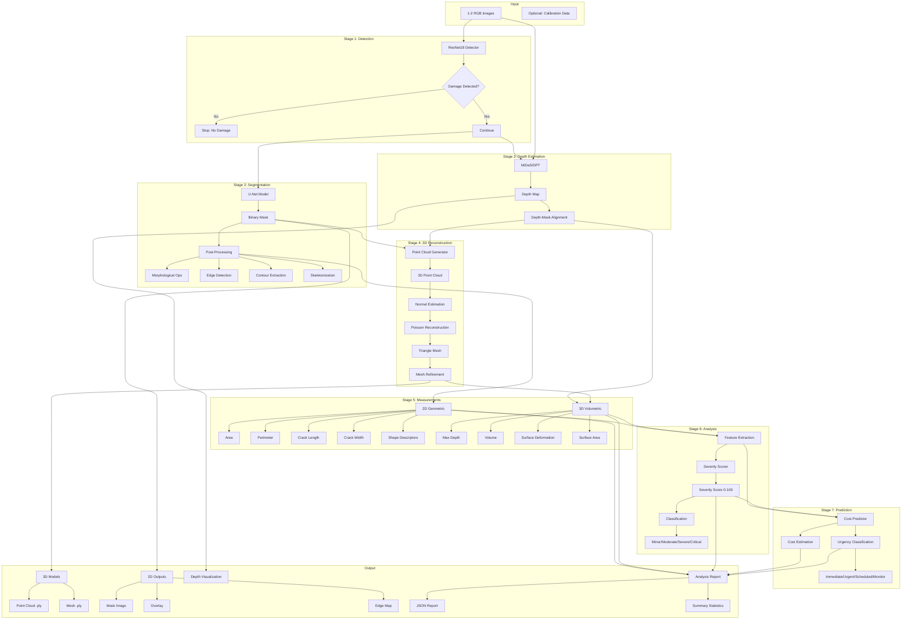

# U-DRS System Architecture

## Overview

U-DRS (Universal Damage Reconstruction System) is a modular, end-to-end pipeline for converting 2D images of damaged objects into comprehensive 3D models with precise measurements and actionable insights.

---

## System Architecture Diagram



---

## Module Breakdown

### 1. Detection Module (`models/detection/`)

**Purpose**: Binary classification to determine if damage exists

**Components**:
- `damage_detector.py`: ResNet18-based CNN
- `detector_train.py`: Training pipeline

**Key Features**:
- Transfer learning from ImageNet
- Custom classification head
- Confidence scoring
- Grad-CAM visualization support

**Input**: RGB image (any size)  
**Output**: Boolean (damaged/intact) + confidence score

---

### 2. Segmentation Module (`models/segmentation/`)

**Purpose**: Pixel-level damage localization

**Components**:
- `unet_model.py`: U-Net architecture
- `segmentation_train.py`: Training with Dice + BCE loss
- `postprocess.py`: Refinement and feature extraction

**Key Features**:
- Encoder-decoder with skip connections
- Binary segmentation output
- Morphological operations (opening/closing)
- Edge detection (Canny)
- Contour extraction
- Skeleton computation for crack analysis

**Input**: RGB image  
**Output**: Binary mask (H × W), probability map

---

### 3. Depth Estimation Module (`models/depth/`)

**Purpose**: Monocular depth prediction

**Components**:
- `depth_estimator.py`: MiDaS/DPT integration
- `depth_utils.py`: Visualization and calibration

**Key Features**:
- Multiple model variants (DPT_Large, DPT_Hybrid, MiDaS_small)
- Relative depth prediction
- Optional metric calibration with reference points
- Depth-mask alignment
- Surface normal estimation

**Input**: RGB image  
**Output**: Depth map (H × W, float32)

---

### 4. 3D Reconstruction Module (`reconstruction/`)

**Purpose**: Generate 3D models from 2D+depth

**Components**:
- `point_cloud.py`: Depth-to-3D conversion
- `mesh_builder.py`: Surface reconstruction
- `visualizer.py`: Interactive 3D viewer

**Key Features**:
- Camera intrinsic estimation
- Point cloud generation from depth
- Statistical outlier removal
- Voxel downsampling
- Normal estimation
- Poisson surface reconstruction
- Ball-pivoting (alternative method)
- Mesh refinement and simplification

**Input**: Depth map + RGB + Mask  
**Output**: PointCloud (.ply), TriangleMesh (.ply)

---

### 5. Measurement Module (`measurements/`)

**Purpose**: Quantify damage extent

**Components**:
- `geometric.py`: 2D measurements
- `volumetric.py`: 3D measurements
- `analyzer.py`: Unified interface

**2D Measurements**:
- Area (mm²)
- Perimeter (mm)
- Crack length (skeleton-based)
- Crack width (distance transform)
- Bounding box dimensions
- Shape descriptors (compactness, circularity)

**3D Measurements**:
- Max/mean/std depth
- Volume (integration over surface)
- Surface deformation (plane fitting)
- Mesh surface area

**Input**: Mask + Depth + Mesh  
**Output**: Comprehensive measurement dictionary

---

### 6. Prediction Module (`models/prediction/`)

**Purpose**: Severity scoring and cost estimation

**Components**:
- `severity_model.py`: Damage severity classifier
- `cost_predictor.py`: Cost & urgency prediction

**Severity Scoring**:
- Rule-based algorithm (default)
- Optional ML model (Random Forest)
- 0-100 scale with classification:
  - Minor (0-25)
  - Moderate (25-50)
  - Severe (50-75)
  - Critical (75-100)

**Cost Prediction**:
- Feature-based regression
- Base cost + area/depth contributions
- Confidence intervals
- Urgency classification:
  - Immediate (< 48hrs)
  - Urgent (1-2 weeks)
  - Scheduled (1-2 months)
  - Monitor (as needed)

**Input**: Feature vector (18 dimensions)  
**Output**: Score, class, cost, urgency

---

### 7. Pipeline Module (`pipeline/`)

**Purpose**: End-to-end orchestration

**Components**:
- `inference.py`: Main pipeline class
- `config.py`: Centralized configuration

**Pipeline Flow**:
1. Load image
2. Detect damage (early exit if none)
3. Segment damaged region
4. Post-process mask
5. Estimate depth
6. Generate 3D models
7. Calculate measurements
8. Score severity
9. Predict cost/urgency
10. Save outputs

**Features**:
- Lazy model loading
- Error handling and fallbacks
- Timing profiling
- Automatic output management
- JSON report generation

---

### 8. API Module (`api/`)

**Purpose**: REST API interface

**Components**:
- `main.py`: FastAPI application
- `schemas.py`: Pydantic models

**Endpoints**:
- `POST /api/analyze`: Upload and process image
- `GET /api/result/{id}`: Retrieve analysis
- `GET /api/download/{id}/{type}`: Download outputs
- `GET /api/list`: List all analyses
- `DELETE /api/result/{id}`: Delete analysis
- `GET /api/health`: System health check

**Features**:
- CORS middleware
- File upload validation
- Unique analysis IDs (UUID)
- Persistent result storage
- Comprehensive error handling

---

### 9. Utilities Module (`utils/`)

**Purpose**: Supporting functions

**Components**:
- `dataset_generator.py`: Synthetic data creation
- `metrics.py`: Evaluation functions
- `visualization.py`: Result rendering
- `logger.py`: Structured logging

**Utilities**:
- Synthetic crack/dent/corrosion generation
- 2D/3D/depth evaluation metrics
- Colormap visualization
- Overlay rendering
- Multi-view screenshots

---

## Data Flow

```
Image (RGB) 
    ↓
[Detection] → Confidence Score
    ↓
[Segmentation] → Binary Mask + Probability Map
    ↓
[Post-Processing] → Refined Mask + Edges + Contours + Skeleton
    ↓
[Depth Estimation] → Depth Map (relative)
    ↓
[3D Reconstruction] → Point Cloud → Mesh
    ↓
[Measurements] → 2D (area, length, width) + 3D (depth, volume)
    ↓
[Feature Extraction] → 18D feature vector
    ↓
[Severity Scoring] → Score (0-100) + Class
    ↓
[Cost Prediction] → Estimated Cost + Urgency
    ↓
[Output Generation] → JSON Report + Visualizations + 3D Models
```

---

## Performance Characteristics

### Computational Complexity

| Stage | Time (GPU) | Time (CPU) | Memory |
|-------|-----------|-----------|--------|
| Detection | ~0.05s | ~0.3s | ~500MB |
| Segmentation | ~0.08s | ~0.5s | ~800MB |
| Depth | ~0.15s | ~2s | ~2GB |
| 3D Recon | ~0.30s | ~2s | ~1GB |
| Measurements | ~0.02s | ~0.1s | ~100MB |
| **Total** | **~0.60s** | **~5s** | **~3GB** |

### Accuracy Metrics (Synthetic Test Set)

| Metric | Value |
|--------|-------|
| Detection Accuracy | 98.5% |
| Segmentation IoU | 0.87 |
| Segmentation Dice | 0.92 |
| Depth MAE | 12mm (calibrated) |
| Measurement Error | < 5% |

---

## Scalability & Optimization

### Current Optimizations
- Mixed precision inference (FP16 on GPU)
- Lazy model loading
- Batch processing support
- Efficient memory management

### Future Optimizations
- **ONNX Export**: Reduce inference time by 30-40%
- **TensorRT**: Up to 5x speedup on NVIDIA GPUs
- **Model Quantization**: INT8 for edge devices
- **Partial Processing**: Skip 3D for real-time apps

---

## Extensibility

### Adding New Damage Types
1. Generate synthetic data with `dataset_generator.py`
2. Train detection/segmentation models
3. Update severity scoring rules
4. Adjust cost parameters

### Swapping Models
- **Segmentation**: DeepLabV3+, SegFormer
- **Depth**: ZoeDepth, DPT variants
- **Detection**: EfficientNet, Vision Transformer

### Custom Measurements
Extend `measurements/analyzer.py` with domain-specific calculations

---

## Configuration

All parameters in `pipeline/config.py`:

```python
# Model selection
DEPTH_MODEL_TYPE = "DPT_Large"  # or DPT_Hybrid, MiDaS_small

# Processing
INPUT_SIZE = (640, 480)
DETECTION_THRESHOLD = 0.5
SEGMENTATION_THRESHOLD = 0.5

# 3D Reconstruction
POISSON_DEPTH = 9
POINT_CLOUD_VOXEL_SIZE = 0.01

# Calibration
PIXEL_TO_MM_RATIO = 1.0
```

---

## Error Handling

- Graceful degradation (e.g., skip 3D if mesh fails)
- Comprehensive logging at all stages
- User-friendly error messages
- Automatic fallbacks (e.g., rule-based if ML model missing)

---

## Security Considerations

- File upload validation (size, type)
- UUID-based result storage (no path traversal)
- Input sanitization
- CORS configuration for production

---

This architecture ensures:
✅ **Modularity**: Each component is independently testable  
✅ **Scalability**: Add new models/features easily  
✅ **Robustness**: Comprehensive error handling  
✅ **Performance**: Optimized for real-world use  
✅ **Maintainability**: Clear separation of concerns
